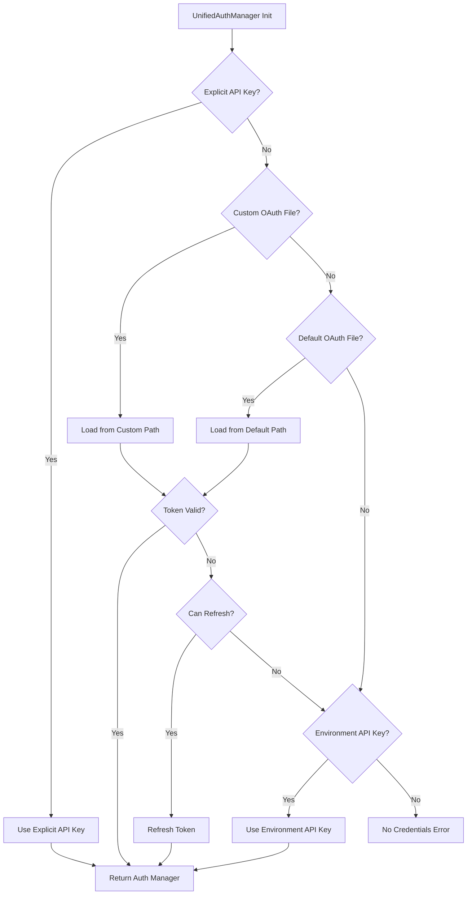

# Advanced Guide

Deep dive into `claude-oauth-auth` internals, optimization techniques, and advanced integration patterns.

## Table of Contents

- [Credential Discovery Internals](#credential-discovery-internals)
- [Priority Cascade Explained](#priority-cascade-explained)
- [Custom Credential Sources](#custom-credential-sources)
- [Thread Safety Considerations](#thread-safety-considerations)
- [Performance Optimization](#performance-optimization)
- [Debugging Techniques](#debugging-techniques)
- [Integration Patterns](#integration-patterns)
- [Concurrent Usage Patterns](#concurrent-usage-patterns)
- [Advanced Configuration](#advanced-configuration)
- [Security Hardening](#security-hardening)

## Credential Discovery Internals

### How Discovery Works

The `UnifiedAuthManager` uses a multi-stage discovery process:

```python
from claude_oauth_auth import UnifiedAuthManager

auth = UnifiedAuthManager()
```

**Discovery Sequence:**

1. **OAuth Discovery**
   - Searches for Claude Code auth file (`~/.config/claude/auth.json`)
   - Checks `CLAUDE_AUTH_FILE` environment variable
   - Validates token format and expiry
   - Attempts token refresh if needed

2. **API Key Discovery**
   - Checks `ANTHROPIC_API_KEY` environment variable
   - Validates API key format
   - Falls back if OAuth unavailable

3. **Explicit Credentials**
   - Uses credentials passed to constructor
   - Highest priority if provided

### Discovery Implementation Details

```python
from claude_oauth_auth import UnifiedAuthManager
import logging

# Enable debug logging to see discovery process
logging.basicConfig(level=logging.DEBUG)

auth = UnifiedAuthManager()

# Discovery logs will show:
# DEBUG:claude_oauth_auth.auth_manager:Searching for OAuth tokens...
# DEBUG:claude_oauth_auth.auth_manager:Found tokens at ~/.config/claude/auth.json
# DEBUG:claude_oauth_auth.auth_manager:Token valid until 2024-12-31 23:59:59
```

### Custom Discovery Paths

You can customize where credentials are discovered:

```python
from claude_oauth_auth import OAuthTokenManager
import os

# Method 1: Environment variable
os.environ['CLAUDE_AUTH_FILE'] = '/custom/path/auth.json'

# Method 2: Direct specification
token_manager = OAuthTokenManager(
    token_file='/custom/path/auth.json'
)

# Method 3: Multiple fallback locations
class MultiLocationAuth(OAuthTokenManager):
    def __init__(self):
        self.locations = [
            '/primary/auth.json',
            '/secondary/auth.json',
            '/fallback/auth.json'
        ]
        super().__init__(token_file=self.find_token_file())

    def find_token_file(self):
        import os
        for location in self.locations:
            if os.path.exists(os.path.expanduser(location)):
                return location
        return self.locations[0]  # Default to first
```

### Discovery Optimization

Cache discovery results for better performance:

```python
from claude_oauth_auth import UnifiedAuthManager
from functools import lru_cache

class CachedAuthManager(UnifiedAuthManager):
    @lru_cache(maxsize=1)
    def _discover_credentials(self):
        """Cache discovery results"""
        return super()._discover_credentials()

    def clear_cache(self):
        """Clear cache when credentials change"""
        self._discover_credentials.cache_clear()

# Use cached manager
auth = CachedAuthManager()
```

## Priority Cascade Explained

### Priority Order

Credentials are discovered in this order (highest to lowest priority):

```python
from claude_oauth_auth import UnifiedAuthManager

# Priority 1: Explicit credentials (highest)
auth1 = UnifiedAuthManager(api_key="explicit-key")

# Priority 2: OAuth tokens from custom location
import os
os.environ['CLAUDE_AUTH_FILE'] = '/custom/auth.json'
auth2 = UnifiedAuthManager()

# Priority 3: OAuth tokens from default location
# ~/.config/claude/auth.json
auth3 = UnifiedAuthManager()

# Priority 4: API key from environment
os.environ['ANTHROPIC_API_KEY'] = 'env-key'
auth4 = UnifiedAuthManager()

# Priority 5: No credentials (lowest)
auth5 = UnifiedAuthManager()  # Will fail if no credentials found
```

### Priority Cascade Diagram



### Overriding Priority

You can override the default priority:

```python
from claude_oauth_auth import UnifiedAuthManager

class CustomPriorityAuth(UnifiedAuthManager):
    def _discover_credentials(self):
        """Custom priority: prefer API key over OAuth"""
        # Try API key first
        api_key = self._discover_api_key()
        if api_key:
            return {'type': 'api_key', 'key': api_key}

        # Fall back to OAuth
        oauth_token = self._discover_oauth_token()
        if oauth_token:
            return {'type': 'oauth', 'token': oauth_token}

        return None
```

## Custom Credential Sources

### Implementing Custom Sources

Create custom credential providers:

```python
from claude_oauth_auth import UnifiedAuthManager
import boto3  # AWS example

class AWSSecretsAuth(UnifiedAuthManager):
    """Load credentials from AWS Secrets Manager"""

    def __init__(self, secret_name='claude/api_key', region='us-east-1'):
        self.secret_name = secret_name
        self.region = region
        super().__init__()

    def _discover_api_key(self):
        """Override to load from AWS Secrets Manager"""
        try:
            client = boto3.client('secretsmanager', region_name=self.region)
            response = client.get_secret_value(SecretId=self.secret_name)
            import json
            secret = json.loads(response['SecretString'])
            return secret.get('api_key')
        except Exception as e:
            print(f"AWS Secrets Manager error: {e}")
            # Fall back to default discovery
            return super()._discover_api_key()

# Usage
auth = AWSSecretsAuth(secret_name='prod/claude/credentials')
```

### HashiCorp Vault Integration

```python
import hvac  # HashiCorp Vault client
from claude_oauth_auth import UnifiedAuthManager

class VaultAuth(UnifiedAuthManager):
    """Load credentials from HashiCorp Vault"""

    def __init__(self, vault_addr, vault_token, secret_path):
        self.client = hvac.Client(url=vault_addr, token=vault_token)
        self.secret_path = secret_path
        super().__init__()

    def _discover_api_key(self):
        """Override to load from Vault"""
        try:
            secret = self.client.secrets.kv.v2.read_secret_version(
                path=self.secret_path
            )
            return secret['data']['data']['api_key']
        except Exception as e:
            print(f"Vault error: {e}")
            return super()._discover_api_key()

# Usage
auth = VaultAuth(
    vault_addr='https://vault.example.com',
    vault_token='vault-token',
    secret_path='secret/claude/credentials'
)
```

### Environment-Specific Credentials

```python
from claude_oauth_auth import UnifiedAuthManager
import os

class EnvironmentAuth(UnifiedAuthManager):
    """Different credentials per environment"""

    def __init__(self):
        self.env = os.getenv('APP_ENV', 'development')
        super().__init__()

    def _discover_api_key(self):
        """Load environment-specific key"""
        env_key_map = {
            'development': 'CLAUDE_DEV_KEY',
            'staging': 'CLAUDE_STAGING_KEY',
            'production': 'CLAUDE_PROD_KEY'
        }

        env_var = env_key_map.get(self.env)
        if env_var:
            key = os.getenv(env_var)
            if key:
                return key

        # Fall back to default
        return super()._discover_api_key()

# Usage
os.environ['APP_ENV'] = 'production'
auth = EnvironmentAuth()
```

### Database Credential Storage

```python
from claude_oauth_auth import UnifiedAuthManager
import psycopg2  # PostgreSQL example

class DatabaseAuth(UnifiedAuthManager):
    """Load credentials from database"""

    def __init__(self, db_config):
        self.db_config = db_config
        super().__init__()

    def _discover_api_key(self):
        """Load from database"""
        try:
            conn = psycopg2.connect(**self.db_config)
            cursor = conn.cursor()
            cursor.execute(
                "SELECT api_key FROM credentials WHERE service = 'claude' AND active = true"
            )
            result = cursor.fetchone()
            cursor.close()
            conn.close()

            if result:
                return result[0]
        except Exception as e:
            print(f"Database error: {e}")

        return super()._discover_api_key()

# Usage
auth = DatabaseAuth({
    'host': 'localhost',
    'database': 'myapp',
    'user': 'app_user',
    'password': 'secret'
})
```

## Thread Safety Considerations

### Thread Safety Guarantees

The library is designed for thread safety:

```python
from claude_oauth_auth import ClaudeClient, UnifiedAuthManager
from concurrent.futures import ThreadPoolExecutor
import threading

# Safe: Single auth manager, multiple clients
auth = UnifiedAuthManager()

def make_request(thread_id):
    # Each thread gets its own client
    client = ClaudeClient(auth=auth)  # Reuses auth manager safely
    response = client.messages.create(
        model="claude-3-5-sonnet-20241022",
        max_tokens=100,
        messages=[{"role": "user", "content": f"Request from thread {thread_id}"}]
    )
    return response

# Run 10 concurrent requests
with ThreadPoolExecutor(max_workers=10) as executor:
    futures = [executor.submit(make_request, i) for i in range(10)]
    results = [future.result() for future in futures]
```

### Token Refresh Race Conditions

Token refresh is protected against race conditions:

```python
from claude_oauth_auth import OAuthTokenManager
import threading

token_manager = OAuthTokenManager()

def concurrent_access(thread_id):
    """Multiple threads accessing tokens simultaneously"""
    for i in range(100):
        # Thread-safe token access
        token = token_manager.get_valid_token()
        # Use token...

# Safe: Multiple threads can call get_valid_token() concurrently
threads = [threading.Thread(target=concurrent_access, args=(i,)) for i in range(5)]
for t in threads:
    t.start()
for t in threads:
    t.join()
```

### Lock-Free Patterns

For high-performance scenarios:

```python
from claude_oauth_auth import UnifiedAuthManager
import threading

class LockFreeAuth:
    """Lock-free credential access"""

    def __init__(self):
        # Initialize once at startup
        self._auth = UnifiedAuthManager()
        self._token = self._auth.get_credentials()
        self._lock = threading.Lock()

    def get_token(self):
        """Lock-free read of cached token"""
        return self._token

    def refresh_token(self):
        """Locked write for refresh"""
        with self._lock:
            self._token = self._auth.get_credentials()
        return self._token

# Usage in high-throughput scenarios
auth = LockFreeAuth()
token = auth.get_token()  # Fast, no locks
```

## Performance Optimization

### Token Caching

Reduce filesystem access:

```python
from claude_oauth_auth import OAuthTokenManager
from functools import lru_cache
import time

class CachedTokenManager(OAuthTokenManager):
    def __init__(self, cache_ttl=300):  # 5 minute cache
        self.cache_ttl = cache_ttl
        self._cached_token = None
        self._cache_time = 0
        super().__init__()

    def get_valid_token(self):
        """Cache tokens to reduce file I/O"""
        now = time.time()

        # Return cached token if valid
        if self._cached_token and (now - self._cache_time) < self.cache_ttl:
            if self.is_token_valid():
                return self._cached_token

        # Refresh cache
        self._cached_token = super().get_valid_token()
        self._cache_time = now
        return self._cached_token
```

### Connection Pooling

Reuse HTTP connections:

```python
from claude_oauth_auth import ClaudeClient
import anthropic

# Create client once, reuse for multiple requests
client = ClaudeClient()

def make_many_requests(prompts):
    """Efficiently process many requests"""
    responses = []
    for prompt in prompts:
        response = client.messages.create(
            model="claude-3-5-sonnet-20241022",
            max_tokens=100,
            messages=[{"role": "user", "content": prompt}]
        )
        responses.append(response)
    return responses

# Reuses underlying HTTP connection pool
prompts = ["Question 1", "Question 2", "Question 3"]
results = make_many_requests(prompts)
```

### Lazy Initialization

Defer credential loading until needed:

```python
from claude_oauth_auth import UnifiedAuthManager

class LazyAuthManager:
    """Lazy credential loading"""

    def __init__(self):
        self._auth = None

    @property
    def auth(self):
        """Load credentials on first access"""
        if self._auth is None:
            self._auth = UnifiedAuthManager()
        return self._auth

    def get_credentials(self):
        return self.auth.get_credentials()

# Fast initialization - no I/O until first use
manager = LazyAuthManager()

# Credentials loaded here
creds = manager.get_credentials()
```

### Batch Processing

Process multiple requests efficiently:

```python
from claude_oauth_auth import ClaudeClient
from concurrent.futures import ThreadPoolExecutor, as_completed

class BatchProcessor:
    """Efficient batch processing"""

    def __init__(self, max_workers=5):
        self.client = ClaudeClient()
        self.max_workers = max_workers

    def process_batch(self, prompts):
        """Process prompts in parallel"""
        results = {}

        with ThreadPoolExecutor(max_workers=self.max_workers) as executor:
            # Submit all requests
            future_to_prompt = {
                executor.submit(self._process_one, prompt): prompt
                for prompt in prompts
            }

            # Collect results as they complete
            for future in as_completed(future_to_prompt):
                prompt = future_to_prompt[future]
                try:
                    result = future.result()
                    results[prompt] = result
                except Exception as e:
                    results[prompt] = {'error': str(e)}

        return results

    def _process_one(self, prompt):
        """Process single prompt"""
        return self.client.messages.create(
            model="claude-3-5-sonnet-20241022",
            max_tokens=100,
            messages=[{"role": "user", "content": prompt}]
        )

# Usage
processor = BatchProcessor(max_workers=10)
results = processor.process_batch([
    "Question 1", "Question 2", "Question 3"
])
```

### Memory Optimization

For long-running applications:

```python
from claude_oauth_auth import ClaudeClient
import gc

class MemoryEfficientClient:
    """Memory-efficient client for long-running apps"""

    def __init__(self):
        self.client = None

    def process(self, prompt):
        """Process request with cleanup"""
        try:
            if self.client is None:
                self.client = ClaudeClient()

            response = self.client.messages.create(
                model="claude-3-5-sonnet-20241022",
                max_tokens=100,
                messages=[{"role": "user", "content": prompt}]
            )
            return response
        finally:
            # Force garbage collection periodically
            gc.collect()

    def cleanup(self):
        """Explicit cleanup"""
        self.client = None
        gc.collect()
```

## Debugging Techniques

### Debug Logging

Enable comprehensive logging:

```python
import logging
from claude_oauth_auth import UnifiedAuthManager

# Configure logging
logging.basicConfig(
    level=logging.DEBUG,
    format='%(asctime)s - %(name)s - %(levelname)s - %(message)s',
    handlers=[
        logging.FileHandler('claude_auth.log'),
        logging.StreamHandler()
    ]
)

# Create auth manager - all operations logged
auth = UnifiedAuthManager()
```

### Authentication Diagnostics

Get detailed auth status:

```python
from claude_oauth_auth import get_auth_status

# Get comprehensive diagnostics
status = get_auth_status()

print("=== Authentication Status ===")
print(f"Summary: {status['summary']}")
print(f"\nOAuth Available: {status['oauth_available']}")
if status['oauth_available']:
    print(f"  Token File: {status['oauth_token_file']}")
    print(f"  Token Valid: {status['oauth_token_valid']}")
    print(f"  Token Expiry: {status['oauth_token_expiry']}")

print(f"\nAPI Key Available: {status['api_key_available']}")
if status['api_key_available']:
    print(f"  Source: {status['api_key_source']}")

print(f"\nRecommendation: {status['recommendation']}")
```

### Token Inspection

Inspect token details:

```python
from claude_oauth_auth import OAuthTokenManager
import json
from datetime import datetime

token_manager = OAuthTokenManager()

# Get token file location
token_file = token_manager.token_file
print(f"Token file: {token_file}")

# Load and inspect tokens
with open(token_file) as f:
    tokens = json.load(f)

print("\n=== Token Details ===")
print(f"Access Token: {tokens['access_token'][:20]}...")
print(f"Refresh Token: {tokens['refresh_token'][:20]}...")
print(f"Expiry (timestamp): {tokens['token_expiry']}")
print(f"Expiry (datetime): {datetime.fromtimestamp(tokens['token_expiry'])}")

# Check validity
is_valid = token_manager.is_token_valid()
print(f"\nToken Valid: {is_valid}")

if is_valid:
    import time
    time_left = tokens['token_expiry'] - time.time()
    print(f"Time remaining: {time_left / 3600:.2f} hours")
```

### Request Tracing

Trace API requests:

```python
from claude_oauth_auth import ClaudeClient
import logging
import time

class TracingClient(ClaudeClient):
    """Client with request tracing"""

    def __init__(self, *args, **kwargs):
        super().__init__(*args, **kwargs)
        self.request_count = 0
        self.logger = logging.getLogger(__name__)

    def messages_create_with_tracing(self, **kwargs):
        """Traced message creation"""
        self.request_count += 1
        request_id = self.request_count

        self.logger.info(f"[Request {request_id}] Starting...")
        start = time.time()

        try:
            response = self.messages.create(**kwargs)
            elapsed = time.time() - start

            self.logger.info(
                f"[Request {request_id}] Success in {elapsed:.2f}s"
            )
            return response
        except Exception as e:
            elapsed = time.time() - start
            self.logger.error(
                f"[Request {request_id}] Failed in {elapsed:.2f}s: {e}"
            )
            raise

# Usage
logging.basicConfig(level=logging.INFO)
client = TracingClient()

response = client.messages_create_with_tracing(
    model="claude-3-5-sonnet-20241022",
    max_tokens=100,
    messages=[{"role": "user", "content": "Hello"}]
)
```

### Error Analysis

Analyze authentication errors:

```python
from claude_oauth_auth import UnifiedAuthManager
import logging

def diagnose_auth_error():
    """Comprehensive error diagnosis"""
    logger = logging.getLogger(__name__)

    try:
        auth = UnifiedAuthManager()
        if not auth.has_credentials():
            logger.error("No credentials found!")
            logger.error("Checked locations:")
            logger.error("  - OAuth: ~/.config/claude/auth.json")
            logger.error("  - API Key: ANTHROPIC_API_KEY env var")
            return False

        logger.info(f"Auth method: {auth.auth_method}")
        return True

    except Exception as e:
        logger.error(f"Authentication error: {e}")
        logger.exception("Full traceback:")
        return False

# Run diagnosis
logging.basicConfig(level=logging.DEBUG)
success = diagnose_auth_error()
```

## Integration Patterns

### Flask Integration

```python
from flask import Flask, request, jsonify
from claude_oauth_auth import ClaudeClient
from functools import wraps

app = Flask(__name__)

# Create client once at app startup
claude_client = ClaudeClient()

def handle_errors(f):
    """Decorator for error handling"""
    @wraps(f)
    def decorated_function(*args, **kwargs):
        try:
            return f(*args, **kwargs)
        except Exception as e:
            return jsonify({'error': str(e)}), 500
    return decorated_function

@app.route('/api/chat', methods=['POST'])
@handle_errors
def chat():
    """Chat endpoint"""
    data = request.json
    prompt = data.get('prompt')

    if not prompt:
        return jsonify({'error': 'prompt required'}), 400

    response = claude_client.messages.create(
        model="claude-3-5-sonnet-20241022",
        max_tokens=1024,
        messages=[{"role": "user", "content": prompt}]
    )

    return jsonify({
        'response': response.content[0].text
    })

@app.route('/api/health', methods=['GET'])
def health():
    """Health check endpoint"""
    from claude_oauth_auth import get_auth_status
    status = get_auth_status()

    return jsonify({
        'status': 'healthy' if status['oauth_available'] or status['api_key_available'] else 'unhealthy',
        'auth_method': 'oauth' if status['oauth_available'] else 'api_key',
        'details': status
    })

if __name__ == '__main__':
    app.run(debug=True)
```

### FastAPI Integration

```python
from fastapi import FastAPI, HTTPException, BackgroundTasks
from pydantic import BaseModel
from claude_oauth_auth import ClaudeClient
from typing import Optional

app = FastAPI()

# Dependency injection
class ClaudeClientDep:
    """Claude client dependency"""
    _client: Optional[ClaudeClient] = None

    @property
    def client(self) -> ClaudeClient:
        if self._client is None:
            self._client = ClaudeClient()
        return self._client

claude_dep = ClaudeClientDep()

class ChatRequest(BaseModel):
    prompt: str
    max_tokens: int = 1024

class ChatResponse(BaseModel):
    response: str

@app.post("/api/chat", response_model=ChatResponse)
async def chat(request: ChatRequest, background_tasks: BackgroundTasks):
    """Async chat endpoint"""
    try:
        # Run in background thread (Claude API is sync)
        response = await run_in_threadpool(
            claude_dep.client.messages.create,
            model="claude-3-5-sonnet-20241022",
            max_tokens=request.max_tokens,
            messages=[{"role": "user", "content": request.prompt}]
        )

        return ChatResponse(response=response.content[0].text)
    except Exception as e:
        raise HTTPException(status_code=500, detail=str(e))

@app.get("/health")
async def health():
    """Health check"""
    from claude_oauth_auth import get_auth_status
    status = get_auth_status()

    return {
        "status": "healthy",
        "auth_available": status['oauth_available'] or status['api_key_available']
    }

# Helper for async
from concurrent.futures import ThreadPoolExecutor
import asyncio

executor = ThreadPoolExecutor(max_workers=10)

async def run_in_threadpool(func, *args, **kwargs):
    """Run sync function in thread pool"""
    loop = asyncio.get_event_loop()
    return await loop.run_in_executor(executor, lambda: func(*args, **kwargs))
```

### Django Integration

```python
# settings.py
CLAUDE_CLIENT = None

# middleware.py
from claude_oauth_auth import ClaudeClient
from django.conf import settings

class ClaudeClientMiddleware:
    """Middleware to inject Claude client"""

    def __init__(self, get_response):
        self.get_response = get_response
        # Initialize client once
        if settings.CLAUDE_CLIENT is None:
            settings.CLAUDE_CLIENT = ClaudeClient()

    def __call__(self, request):
        request.claude = settings.CLAUDE_CLIENT
        response = self.get_response(request)
        return response

# views.py
from django.http import JsonResponse
from django.views.decorators.http import require_http_methods
import json

@require_http_methods(["POST"])
def chat_view(request):
    """Chat view"""
    try:
        data = json.loads(request.body)
        prompt = data.get('prompt')

        if not prompt:
            return JsonResponse({'error': 'prompt required'}, status=400)

        response = request.claude.messages.create(
            model="claude-3-5-sonnet-20241022",
            max_tokens=1024,
            messages=[{"role": "user", "content": prompt}]
        )

        return JsonResponse({
            'response': response.content[0].text
        })
    except Exception as e:
        return JsonResponse({'error': str(e)}, status=500)
```

### CLI Tool Integration

```python
import click
from claude_oauth_auth import ClaudeClient, get_auth_status

@click.group()
def cli():
    """Claude CLI tool"""
    pass

@cli.command()
@click.argument('prompt')
@click.option('--max-tokens', default=1024, help='Maximum tokens')
@click.option('--model', default='claude-3-5-sonnet-20241022', help='Model name')
def chat(prompt, max_tokens, model):
    """Send a chat message to Claude"""
    try:
        client = ClaudeClient()
        response = client.messages.create(
            model=model,
            max_tokens=max_tokens,
            messages=[{"role": "user", "content": prompt}]
        )
        click.echo(response.content[0].text)
    except Exception as e:
        click.echo(f"Error: {e}", err=True)
        raise click.Abort()

@cli.command()
def status():
    """Check authentication status"""
    status = get_auth_status()
    click.echo("=== Authentication Status ===")
    click.echo(f"Summary: {status['summary']}")
    click.echo(f"OAuth Available: {status['oauth_available']}")
    click.echo(f"API Key Available: {status['api_key_available']}")

if __name__ == '__main__':
    cli()
```

## Concurrent Usage Patterns

### Thread Pool Pattern

```python
from claude_oauth_auth import ClaudeClient
from concurrent.futures import ThreadPoolExecutor, as_completed
import time

def concurrent_requests(prompts, max_workers=5):
    """Process multiple prompts concurrently"""
    client = ClaudeClient()
    results = []

    with ThreadPoolExecutor(max_workers=max_workers) as executor:
        futures = {
            executor.submit(
                client.messages.create,
                model="claude-3-5-sonnet-20241022",
                max_tokens=100,
                messages=[{"role": "user", "content": prompt}]
            ): prompt
            for prompt in prompts
        }

        for future in as_completed(futures):
            prompt = futures[future]
            try:
                result = future.result()
                results.append({
                    'prompt': prompt,
                    'response': result.content[0].text
                })
            except Exception as e:
                results.append({
                    'prompt': prompt,
                    'error': str(e)
                })

    return results

# Usage
prompts = [f"Question {i}" for i in range(10)]
results = concurrent_requests(prompts, max_workers=5)
```

### Async/Await Pattern

```python
import asyncio
from claude_oauth_auth import ClaudeClient
from concurrent.futures import ThreadPoolExecutor

class AsyncClaudeClient:
    """Async wrapper for Claude client"""

    def __init__(self):
        self.client = ClaudeClient()
        self.executor = ThreadPoolExecutor(max_workers=10)

    async def create_message(self, **kwargs):
        """Async message creation"""
        loop = asyncio.get_event_loop()
        return await loop.run_in_executor(
            self.executor,
            lambda: self.client.messages.create(**kwargs)
        )

    async def batch_create(self, prompts):
        """Create multiple messages concurrently"""
        tasks = [
            self.create_message(
                model="claude-3-5-sonnet-20241022",
                max_tokens=100,
                messages=[{"role": "user", "content": prompt}]
            )
            for prompt in prompts
        ]
        return await asyncio.gather(*tasks, return_exceptions=True)

# Usage
async def main():
    client = AsyncClaudeClient()
    prompts = ["Question 1", "Question 2", "Question 3"]
    results = await client.batch_create(prompts)

    for prompt, result in zip(prompts, results):
        if isinstance(result, Exception):
            print(f"{prompt}: Error - {result}")
        else:
            print(f"{prompt}: {result.content[0].text}")

# Run
asyncio.run(main())
```

### Queue-Based Pattern

```python
from claude_oauth_auth import ClaudeClient
from queue import Queue
from threading import Thread
import time

class QueuedProcessor:
    """Queue-based request processing"""

    def __init__(self, num_workers=5):
        self.client = ClaudeClient()
        self.request_queue = Queue()
        self.result_queue = Queue()
        self.workers = []
        self.num_workers = num_workers
        self.running = False

    def worker(self):
        """Worker thread"""
        while self.running:
            try:
                request = self.request_queue.get(timeout=1)
                if request is None:
                    break

                prompt, request_id = request
                try:
                    response = self.client.messages.create(
                        model="claude-3-5-sonnet-20241022",
                        max_tokens=100,
                        messages=[{"role": "user", "content": prompt}]
                    )
                    self.result_queue.put((request_id, response.content[0].text, None))
                except Exception as e:
                    self.result_queue.put((request_id, None, str(e)))
                finally:
                    self.request_queue.task_done()
            except:
                pass

    def start(self):
        """Start worker threads"""
        self.running = True
        for _ in range(self.num_workers):
            t = Thread(target=self.worker)
            t.start()
            self.workers.append(t)

    def stop(self):
        """Stop worker threads"""
        self.running = False
        for _ in range(self.num_workers):
            self.request_queue.put(None)
        for worker in self.workers:
            worker.join()

    def submit(self, prompt, request_id):
        """Submit request"""
        self.request_queue.put((prompt, request_id))

    def get_result(self, timeout=None):
        """Get result"""
        return self.result_queue.get(timeout=timeout)

# Usage
processor = QueuedProcessor(num_workers=5)
processor.start()

# Submit requests
for i in range(10):
    processor.submit(f"Question {i}", i)

# Collect results
results = {}
for _ in range(10):
    request_id, response, error = processor.get_result()
    results[request_id] = {'response': response, 'error': error}

processor.stop()
```

## Advanced Configuration

### Configuration File

```python
# config.yaml
oauth:
  token_file: ~/.config/claude/auth.json
  refresh_threshold: 300  # seconds
  auto_refresh: true

api_key:
  env_var: ANTHROPIC_API_KEY
  fallback: true

client:
  timeout: 30
  max_retries: 3
  retry_delay: 1

logging:
  level: INFO
  file: /var/log/claude-auth.log
```

```python
# Load configuration
import yaml
from claude_oauth_auth import UnifiedAuthManager

class ConfigurableAuth(UnifiedAuthManager):
    """Auth manager with config file support"""

    def __init__(self, config_file='config.yaml'):
        with open(config_file) as f:
            self.config = yaml.safe_load(f)

        # Apply configuration
        import os
        if 'oauth' in self.config:
            os.environ['CLAUDE_AUTH_FILE'] = self.config['oauth']['token_file']

        super().__init__()

# Usage
auth = ConfigurableAuth('config.yaml')
```

## Security Hardening

### Credential Encryption

```python
from cryptography.fernet import Fernet
from claude_oauth_auth import UnifiedAuthManager
import os
import json

class EncryptedAuth(UnifiedAuthManager):
    """Auth manager with encrypted credentials"""

    def __init__(self, encryption_key=None):
        if encryption_key is None:
            encryption_key = os.getenv('CLAUDE_ENCRYPTION_KEY')
        self.cipher = Fernet(encryption_key.encode())
        super().__init__()

    def _load_encrypted_api_key(self, encrypted_file):
        """Load and decrypt API key"""
        with open(encrypted_file, 'rb') as f:
            encrypted_data = f.read()
        decrypted_data = self.cipher.decrypt(encrypted_data)
        return decrypted_data.decode()

    def _discover_api_key(self):
        """Override to support encrypted keys"""
        encrypted_file = os.getenv('CLAUDE_ENCRYPTED_KEY_FILE')
        if encrypted_file and os.path.exists(encrypted_file):
            return self._load_encrypted_api_key(encrypted_file)
        return super()._discover_api_key()

# Generate encryption key (once)
# key = Fernet.generate_key()
# print(key.decode())

# Usage
os.environ['CLAUDE_ENCRYPTION_KEY'] = 'your-encryption-key'
auth = EncryptedAuth()
```

### Credential Rotation

```python
from claude_oauth_auth import UnifiedAuthManager
from datetime import datetime, timedelta
import json

class RotatingAuth(UnifiedAuthManager):
    """Auth manager with automatic credential rotation"""

    def __init__(self, rotation_days=90):
        self.rotation_days = rotation_days
        self.rotation_file = 'credential_rotation.json'
        super().__init__()
        self.check_rotation_needed()

    def check_rotation_needed(self):
        """Check if credentials need rotation"""
        if not os.path.exists(self.rotation_file):
            self.save_rotation_date()
            return

        with open(self.rotation_file) as f:
            data = json.load(f)
            last_rotation = datetime.fromisoformat(data['last_rotation'])

        if datetime.now() - last_rotation > timedelta(days=self.rotation_days):
            print(f"WARNING: Credentials haven't been rotated in {self.rotation_days} days!")
            print("Please rotate your credentials.")

    def save_rotation_date(self):
        """Save rotation date"""
        with open(self.rotation_file, 'w') as f:
            json.dump({
                'last_rotation': datetime.now().isoformat()
            }, f)

# Usage
auth = RotatingAuth(rotation_days=90)
```

## Next Steps

- Explore [Architecture Documentation](architecture.md) for system design
- Review [Integration Examples](examples.md) for real-world use cases
- Check [FAQ](faq.md) for common questions
- See [Migration Guide](migration.md) for upgrading from other solutions
