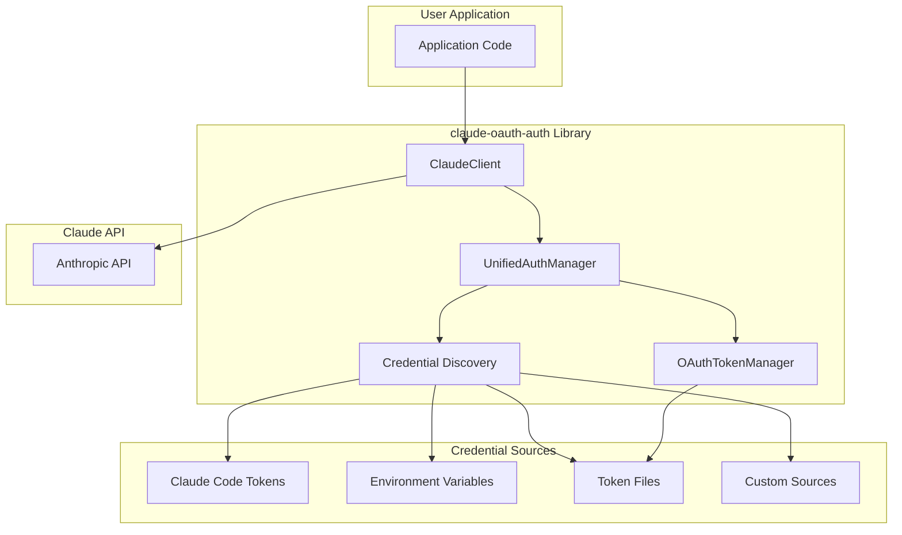
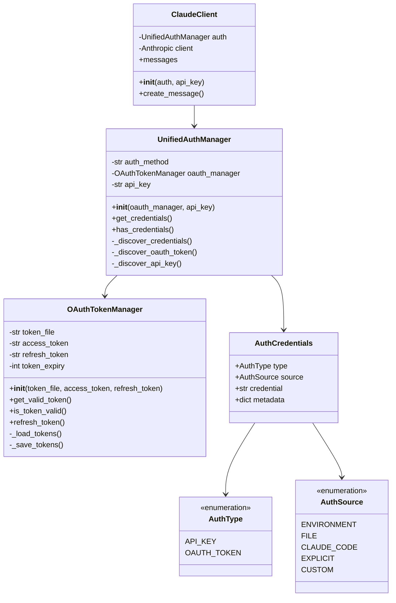
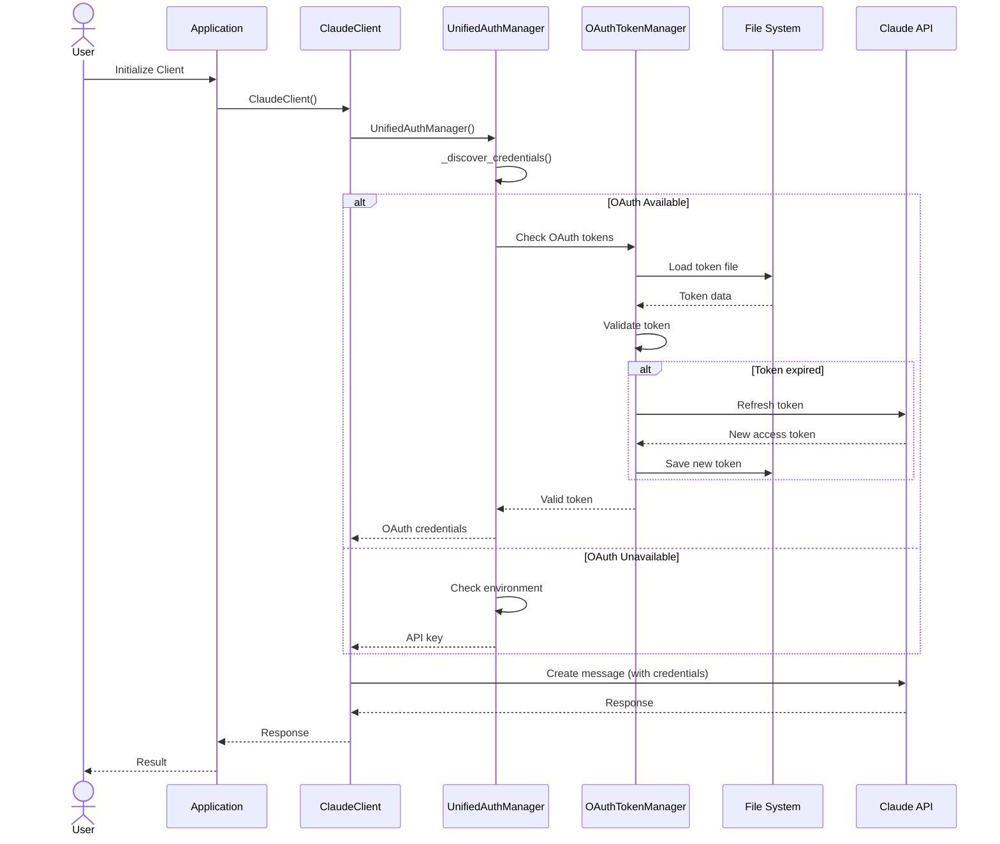
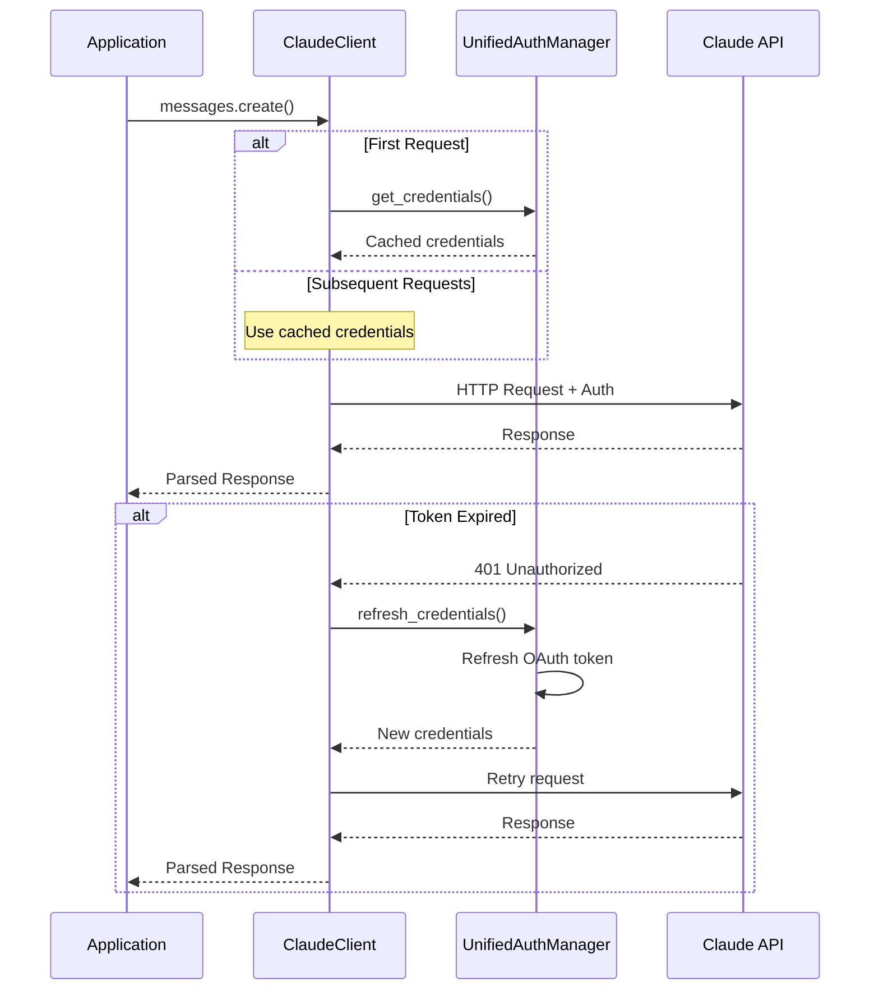
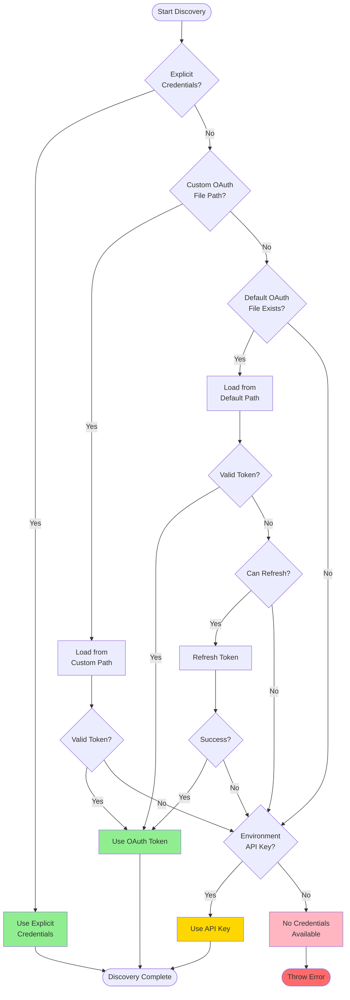
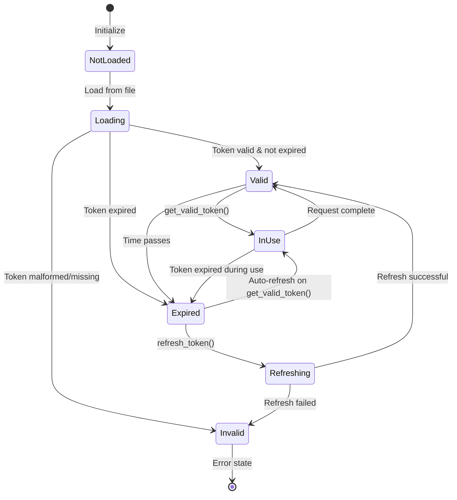
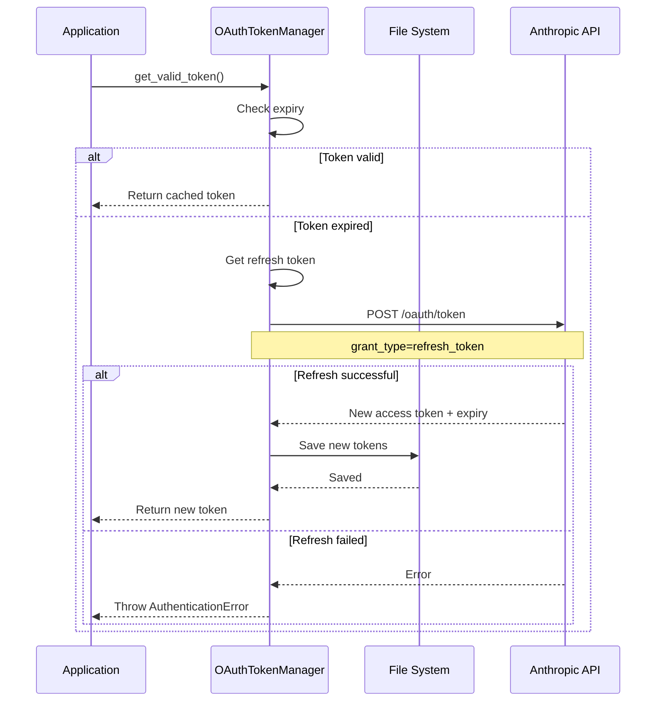
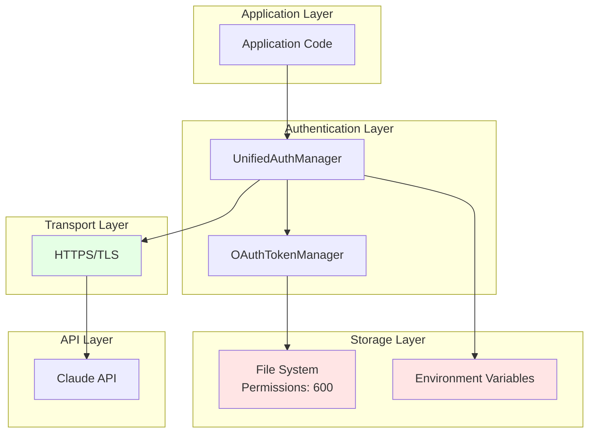
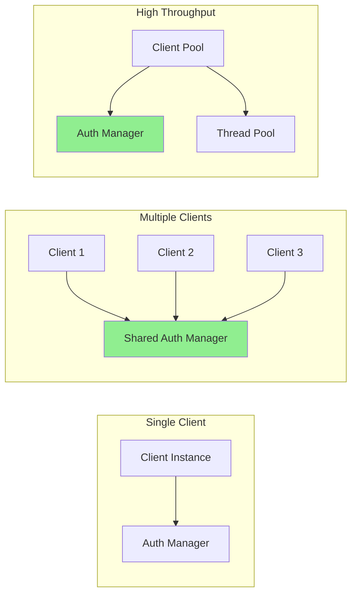

# Architecture Documentation

Comprehensive overview of the `claude-oauth-auth` system architecture, design decisions, and extension points.

## Table of Contents

- [System Overview](#system-overview)
- [Component Architecture](#component-architecture)
- [Authentication Flow](#authentication-flow)
- [Credential Discovery Flow](#credential-discovery-flow)
- [Token Lifecycle](#token-lifecycle)
- [Design Decisions](#design-decisions)
- [Extension Points](#extension-points)
- [Security Architecture](#security-architecture)
- [Performance Considerations](#performance-considerations)

## System Overview

`claude-oauth-auth` is a lightweight authentication abstraction layer for the Anthropic Claude API. It provides a unified interface for multiple authentication methods while maintaining simplicity and extensibility.

### High-Level Architecture



### Core Principles

1. **Zero Configuration**: Works out of the box with Claude Code
2. **Graceful Degradation**: Falls back through credential sources
3. **Extensibility**: Easy to add custom credential providers
4. **Thread Safety**: Safe for concurrent use
5. **Minimal Dependencies**: Small footprint, few external dependencies

## Component Architecture

### Component Diagram



### Component Descriptions

#### ClaudeClient

**Purpose**: Main interface for making Claude API requests with automatic authentication.

**Responsibilities**:
- Initialize Anthropic client with appropriate credentials
- Provide access to Claude API methods
- Handle authentication errors gracefully

**Key Methods**:
```python
class ClaudeClient:
    def __init__(self, auth=None, api_key=None):
        """Initialize with auth manager or API key"""

    @property
    def messages(self):
        """Access to messages API"""
```

#### UnifiedAuthManager

**Purpose**: Central authentication coordinator that discovers and manages credentials from multiple sources.

**Responsibilities**:
- Discover credentials from various sources
- Maintain priority order for credential sources
- Provide unified interface for credential access
- Support both OAuth and API key authentication

**Key Methods**:
```python
class UnifiedAuthManager:
    def get_credentials(self) -> dict:
        """Get active credentials"""

    def has_credentials(self) -> bool:
        """Check if any credentials available"""

    def _discover_credentials(self) -> AuthCredentials:
        """Internal: discover from all sources"""
```

#### OAuthTokenManager

**Purpose**: Manages OAuth token lifecycle including loading, validation, and refresh.

**Responsibilities**:
- Load tokens from file system
- Validate token expiration
- Automatically refresh expired tokens
- Persist tokens securely

**Key Methods**:
```python
class OAuthTokenManager:
    def get_valid_token(self) -> str:
        """Get valid access token (auto-refresh if needed)"""

    def is_token_valid(self) -> bool:
        """Check if current token is valid"""

    def refresh_token(self) -> str:
        """Force token refresh"""
```

## Authentication Flow

### Complete Authentication Flow



### Request Flow Sequence



## Credential Discovery Flow

### Discovery Flowchart



### Discovery Priority Matrix

| Priority | Source | Environment Variable | File Path | Fallback |
|----------|--------|---------------------|-----------|----------|
| 1 | Explicit API Key | N/A | N/A | No |
| 2 | Explicit OAuth | N/A | Custom path | No |
| 3 | Custom OAuth File | `CLAUDE_AUTH_FILE` | Custom path | Yes (to env) |
| 4 | Default OAuth File | N/A | `~/.config/claude/auth.json` | Yes (to env) |
| 5 | Environment API Key | `ANTHROPIC_API_KEY` | N/A | No |
| 6 | No Credentials | N/A | N/A | Error |

## Token Lifecycle

### OAuth Token State Machine



### Token Refresh Flow



## Design Decisions

### Decision 1: Unified Auth Manager

**Decision**: Create a single `UnifiedAuthManager` instead of separate managers for each auth type.

**Rationale**:
- Simplifies user-facing API
- Enables automatic fallback between auth methods
- Reduces cognitive load on developers
- Maintains flexibility for custom auth sources

**Trade-offs**:
- Slightly more complex internal implementation
- Could hide which auth method is being used
- Mitigated by exposing `auth_method` property

### Decision 2: Automatic Token Refresh

**Decision**: Automatically refresh OAuth tokens before expiration.

**Rationale**:
- Improves user experience (no manual intervention)
- Reduces authentication errors
- Aligns with OAuth 2.0 best practices
- Prevents service interruptions

**Implementation**:
- Check expiry before every token access
- Refresh if within 5 minutes of expiration
- Thread-safe refresh to prevent race conditions

**Trade-offs**:
- Adds network overhead for refresh
- Could fail silently if refresh endpoint down
- Mitigated by falling back to API key

### Decision 3: File-Based Token Storage

**Decision**: Store OAuth tokens in JSON files on disk.

**Rationale**:
- Simple and universal (works on all platforms)
- Compatible with Claude Code's storage format
- No additional dependencies required
- Easy to backup and transfer

**Security Considerations**:
- File permissions set to 600 (user-only)
- Tokens stored in user's home directory
- Clear documentation on security best practices

**Trade-offs**:
- Not as secure as OS keychain
- Vulnerable if file system compromised
- Future: Could add keychain support as optional

### Decision 4: Minimal Dependencies

**Decision**: Keep external dependencies to minimum (only `anthropic` SDK required).

**Rationale**:
- Reduces installation size
- Minimizes version conflicts
- Improves reliability
- Faster installation

**Current Dependencies**:
- `anthropic` - Required for API client
- Standard library only for auth logic

**Trade-offs**:
- Can't use advanced features from other libraries
- Need to implement some functionality ourselves
- Worth it for simplicity and reliability

### Decision 5: Thread Safety by Default

**Decision**: Make all components thread-safe without requiring user intervention.

**Rationale**:
- Prevents subtle concurrency bugs
- Enables use in web frameworks (Flask, Django, FastAPI)
- Supports concurrent request processing
- No performance penalty in single-threaded use

**Implementation**:
- Thread-safe token refresh
- Atomic file operations
- Immutable credential objects

**Trade-offs**:
- Slightly more complex implementation
- Small overhead from locking
- Worth it for safety and versatility

### Decision 6: Discovery Over Configuration

**Decision**: Automatically discover credentials rather than requiring explicit configuration.

**Rationale**:
- Zero-configuration experience for Claude Code users
- Reduces boilerplate code
- Follows "convention over configuration" principle
- Still allows explicit configuration when needed

**Implementation**:
- Search standard locations automatically
- Use sensible defaults
- Allow overrides via environment variables

**Trade-offs**:
- Less explicit (could be confusing)
- Mitigated by logging and diagnostics
- Clear documentation of search order

## Extension Points

### Custom Authentication Provider

Extend `UnifiedAuthManager` to add custom credential sources:

```python
from claude_oauth_auth import UnifiedAuthManager

class CustomAuthProvider(UnifiedAuthManager):
    """Custom authentication provider"""

    def _discover_credentials(self):
        """Override discovery logic"""
        # Your custom discovery logic
        custom_creds = self.load_from_custom_source()
        if custom_creds:
            return custom_creds

        # Fall back to default discovery
        return super()._discover_credentials()

    def load_from_custom_source(self):
        """Implement your custom loading logic"""
        pass
```

### Custom Token Storage

Extend `OAuthTokenManager` for custom storage backends:

```python
from claude_oauth_auth import OAuthTokenManager

class DatabaseTokenManager(OAuthTokenManager):
    """Store tokens in database instead of files"""

    def __init__(self, db_connection):
        self.db = db_connection
        # Don't call super().__init__() to skip file-based init
        self.access_token = None
        self.refresh_token = None
        self.token_expiry = None

    def _load_tokens(self):
        """Load from database"""
        cursor = self.db.cursor()
        cursor.execute("SELECT access_token, refresh_token, expiry FROM tokens WHERE service='claude'")
        result = cursor.fetchone()
        if result:
            self.access_token = result[0]
            self.refresh_token = result[1]
            self.token_expiry = result[2]

    def _save_tokens(self):
        """Save to database"""
        cursor = self.db.cursor()
        cursor.execute(
            "UPDATE tokens SET access_token=?, refresh_token=?, expiry=? WHERE service='claude'",
            (self.access_token, self.refresh_token, self.token_expiry)
        )
        self.db.commit()
```

### Custom Credential Validation

Add custom validation logic:

```python
from claude_oauth_auth import UnifiedAuthManager

class ValidatingAuthManager(UnifiedAuthManager):
    """Auth manager with custom validation"""

    def get_credentials(self):
        """Override to add validation"""
        creds = super().get_credentials()

        # Custom validation
        if not self.validate_credentials(creds):
            raise ValueError("Credentials failed validation")

        return creds

    def validate_credentials(self, creds):
        """Implement your validation logic"""
        # Example: check credential format, test with API, etc.
        return True
```

### Middleware Pattern

Add middleware for logging, metrics, etc:

```python
from claude_oauth_auth import ClaudeClient

class MiddlewareClient(ClaudeClient):
    """Client with middleware support"""

    def __init__(self, *args, **kwargs):
        super().__init__(*args, **kwargs)
        self.middlewares = []

    def add_middleware(self, middleware):
        """Add middleware"""
        self.middlewares.append(middleware)

    def messages_create(self, **kwargs):
        """Create message with middleware"""
        # Pre-request middleware
        for mw in self.middlewares:
            kwargs = mw.before_request(kwargs)

        # Make request
        response = self.messages.create(**kwargs)

        # Post-request middleware
        for mw in reversed(self.middlewares):
            response = mw.after_request(response)

        return response

# Example middleware
class LoggingMiddleware:
    def before_request(self, kwargs):
        print(f"Request: {kwargs.get('messages', [])}")
        return kwargs

    def after_request(self, response):
        print(f"Response: {response.content[0].text[:50]}...")
        return response

# Usage
client = MiddlewareClient()
client.add_middleware(LoggingMiddleware())
```

## Security Architecture

### Security Layers



### Security Features

1. **Secure Token Storage**
   - File permissions set to 600 (user-only read/write)
   - Tokens never logged or printed
   - Automatic cleanup on errors

2. **Transport Security**
   - All API communication over HTTPS
   - TLS certificate validation
   - No credential transmission in URLs

3. **Token Lifecycle Security**
   - Automatic refresh before expiration
   - Immediate invalidation on error
   - No token caching in memory longer than needed

4. **Environment Isolation**
   - Separate credentials per environment
   - No cross-environment credential leakage
   - Clear separation of development/production

5. **Audit Trail**
   - Optional logging of auth events
   - No sensitive data in logs
   - Configurable log levels

## Performance Considerations

### Performance Characteristics

| Operation | Time Complexity | I/O Operations | Caching |
|-----------|----------------|----------------|---------|
| Client initialization | O(1) | 1 file read | Yes |
| Token validation | O(1) | 0 (memory) | N/A |
| Token refresh | O(1) | 1 API call + 1 file write | Yes |
| Credential discovery | O(n) | n file checks | Yes |
| API request | O(1) | 1 API call | No |

### Optimization Strategies

1. **Lazy Loading**
   - Credentials loaded on first use
   - Reduces startup time
   - Minimizes unnecessary I/O

2. **Caching**
   - Credentials cached in memory after discovery
   - Tokens cached between refresh cycles
   - Reduces file system access

3. **Connection Pooling**
   - HTTP connections reused via `anthropic` SDK
   - Reduces latency for subsequent requests
   - Automatic cleanup

4. **Async Support**
   - Can be wrapped for async/await usage
   - Thread pool executor for concurrent requests
   - Non-blocking token refresh

### Scalability Considerations



**Recommendations**:
- Single auth manager per application
- Client pool for high-throughput scenarios
- Thread pool for concurrent requests
- Monitor token refresh rate to avoid API limits

## Next Steps

- Review [Advanced Guide](advanced.md) for optimization techniques
- Check [Migration Guide](migration.md) for upgrading from other solutions
- Explore [Examples](examples.md) for integration patterns
- See [FAQ](faq.md) for common questions
