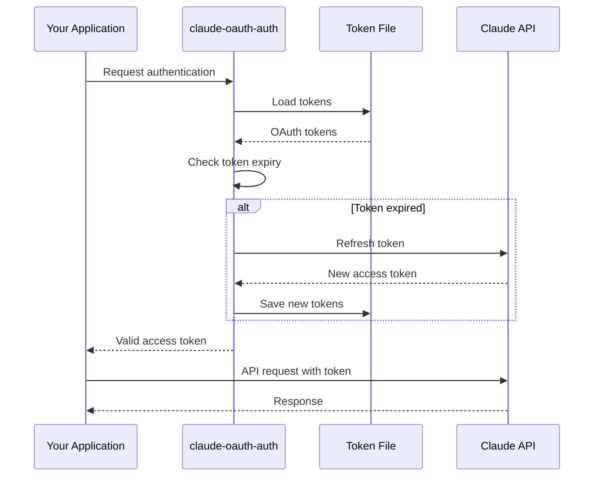
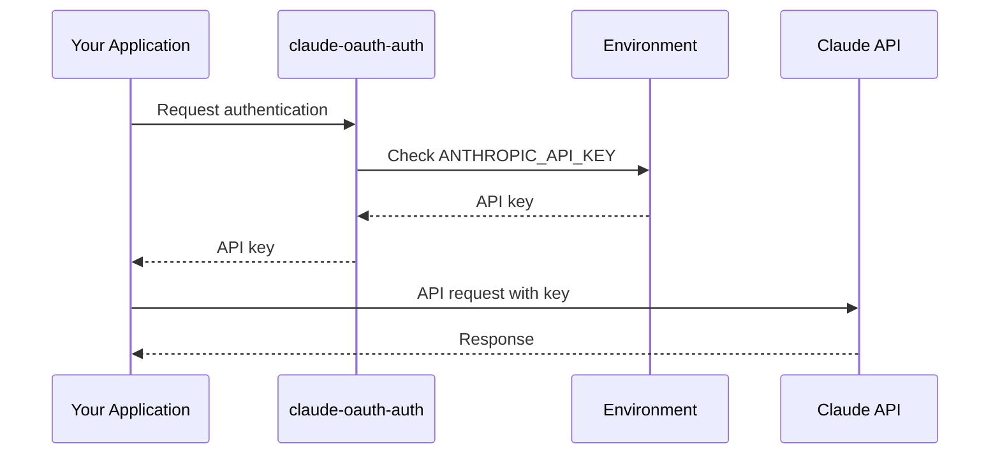
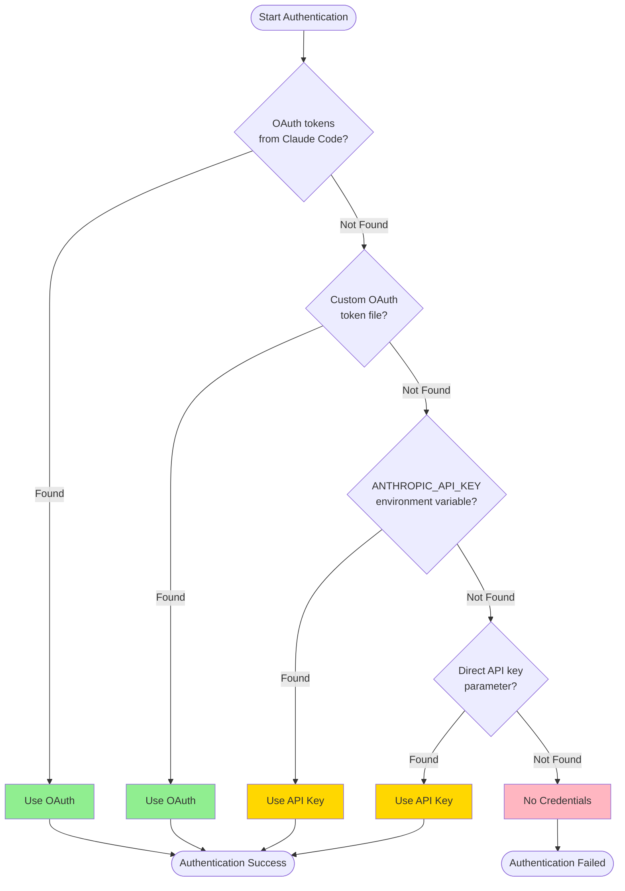

# Authentication Flow

Complete guide to authentication mechanisms in `claude-oauth-auth`.

## Overview

`claude-oauth-auth` supports two primary authentication methods:

1. **OAuth 2.0** - Secure, token-based authentication with automatic refresh
2. **API Key** - Traditional API key authentication

The library automatically discovers and manages credentials, choosing the best available method.

## Authentication Methods

### OAuth 2.0 Authentication

OAuth 2.0 is the recommended authentication method, offering enhanced security and automatic token management.

#### How It Works



#### Token Discovery

The library searches for OAuth tokens in these locations:

**Linux/macOS:**
1. `$CLAUDE_AUTH_FILE` (if set)
2. `~/.config/claude/auth.json`
3. `~/.claude/auth.json`

**Windows:**
1. `%CLAUDE_AUTH_FILE%` (if set)
2. `%APPDATA%\claude\auth.json`
3. `%USERPROFILE%\.claude\auth.json`

#### Token Structure

OAuth tokens are stored in JSON format:

```json
{
  "access_token": "eyJ...",
  "refresh_token": "rt_...",
  "token_type": "Bearer",
  "expires_at": 1234567890,
  "scope": "api"
}
```

#### Using OAuth

```python
from claude_oauth_auth import OAuthTokenManager

# Automatic discovery from Claude Code
token_manager = OAuthTokenManager()

# Get a valid token (auto-refreshes if needed)
access_token = token_manager.get_valid_token()

# Check token status
print(f"Token valid: {token_manager.is_token_valid()}")
print(f"Expires at: {token_manager.get_token_expiration()}")
```

#### Manual OAuth Configuration

For custom OAuth setups:

```python
from claude_oauth_auth import OAuthTokenManager

token_manager = OAuthTokenManager(
    refresh_token="your_refresh_token",
    access_token="your_access_token",
    token_expiry=1234567890,
    client_id="your_client_id",
    token_file="~/.my-app/tokens.json"
)
```

### API Key Authentication

API key authentication is simpler but requires manual key management.

#### How It Works



#### API Key Discovery

The library searches for API keys in order:

1. Direct parameter: `ClaudeClient(api_key="...")`
2. Environment variable: `ANTHROPIC_API_KEY`
3. Configuration file (if specified)

#### Setting API Key

**Via Environment Variable (Recommended):**

```bash
# Linux/macOS
export ANTHROPIC_API_KEY="sk-ant-api03-..."

# Windows PowerShell
$env:ANTHROPIC_API_KEY="sk-ant-api03-..."

# Windows Command Prompt
set ANTHROPIC_API_KEY=sk-ant-api03-...
```

**Via Code:**

```python
from claude_oauth_auth import ClaudeClient

# Direct API key
client = ClaudeClient(api_key="sk-ant-api03-...")
```

**Via .env File:**

Create a `.env` file:

```
ANTHROPIC_API_KEY=sk-ant-api03-...
```

Load with python-dotenv:

```python
from dotenv import load_dotenv
from claude_oauth_auth import ClaudeClient

load_dotenv()
client = ClaudeClient()  # Reads from environment
```

## Unified Authentication

The `UnifiedAuthManager` automatically tries multiple authentication methods in priority order.

### Authentication Cascade



### Usage

```python
from claude_oauth_auth import UnifiedAuthManager

# Automatic discovery
auth = UnifiedAuthManager()

# Check what was found
print(f"Method: {auth.auth_method}")  # "oauth" or "api_key"
print(f"Has credentials: {auth.has_credentials()}")

# Get credentials
credentials = auth.get_credentials()
print(credentials)
```

### Preference Control

Override the default priority:

```python
from claude_oauth_auth import UnifiedAuthManager

# Prefer API key over OAuth
auth = UnifiedAuthManager(
    api_key="sk-ant-...",
    prefer_oauth=False
)

# Disable OAuth fallback
auth = UnifiedAuthManager(
    oauth_fallback=False
)
```

## Token Management

### Automatic Token Refresh

OAuth tokens are automatically refreshed before expiration:

```python
from claude_oauth_auth import OAuthTokenManager

token_manager = OAuthTokenManager()

# Token refresh happens automatically
token = token_manager.get_valid_token()
```

**Default Behavior:**
- Tokens refresh 5 minutes (300 seconds) before expiry
- Failed refresh attempts fallback to API key if available
- Refreshed tokens are automatically saved

### Manual Token Refresh

Force a token refresh:

```python
from claude_oauth_auth import OAuthTokenManager

token_manager = OAuthTokenManager()

# Force refresh
try:
    new_token = token_manager.refresh_token()
    print(f"Token refreshed: {new_token[:20]}...")
except Exception as e:
    print(f"Refresh failed: {e}")
```

### Token Validation

Check token status before use:

```python
from claude_oauth_auth import OAuthTokenManager
import datetime

token_manager = OAuthTokenManager()

# Check validity
if token_manager.is_token_valid():
    print("Token is valid")

    # Get expiration time
    expiry = token_manager.get_token_expiration()

    # Calculate time remaining
    now = datetime.datetime.now(datetime.timezone.utc)
    time_left = expiry - now

    print(f"Token expires in: {time_left}")
else:
    print("Token is expired or invalid")
```

### Custom Refresh Threshold

Configure when tokens should refresh:

```python
from claude_oauth_auth import OAuthTokenManager

# Refresh 10 minutes before expiry
token_manager = OAuthTokenManager(
    token_expiry_threshold=600  # seconds
)
```

## Token Storage

### Storage Locations

**Default Locations:**
- Linux/macOS: `~/.config/claude/auth.json`
- Windows: `%APPDATA%\claude\auth.json`

**Custom Location:**

```python
from claude_oauth_auth import OAuthTokenManager

token_manager = OAuthTokenManager(
    token_file="~/.my-app/tokens.json"
)
```

**Environment Variable:**

```bash
export CLAUDE_AUTH_FILE="/path/to/custom/auth.json"
```

### In-Memory Only

Disable persistent storage:

```python
from claude_oauth_auth import OAuthTokenManager

# Tokens only in memory (not saved to disk)
token_manager = OAuthTokenManager(
    persist_tokens=False
)
```

### Secure Storage

**File Permissions (Linux/macOS):**

```bash
# Set secure permissions on token file
chmod 600 ~/.config/claude/auth.json

# Verify permissions
ls -l ~/.config/claude/auth.json
# Should show: -rw------- (600)
```

**Encryption (Advanced):**

For production, consider encrypting token files:

```python
import json
from cryptography.fernet import Fernet

# Generate encryption key (store securely!)
key = Fernet.generate_key()
cipher = Fernet(key)

# Encrypt tokens
with open("auth.json", "rb") as f:
    encrypted = cipher.encrypt(f.read())

with open("auth.json.encrypted", "wb") as f:
    f.write(encrypted)
```

## Authentication Best Practices

### 1. Use OAuth When Possible

OAuth provides better security with automatic token refresh:

```python
from claude_oauth_auth import UnifiedAuthManager

# Prefers OAuth over API key
auth = UnifiedAuthManager()
```

### 2. Never Commit Credentials

Add to `.gitignore`:

```gitignore
# Authentication files
.env
auth.json
tokens.json
*.key
config.json
```

### 3. Use Environment Variables in Production

```python
import os
from claude_oauth_auth import ClaudeClient

# Good: From environment
api_key = os.getenv("ANTHROPIC_API_KEY")
if not api_key:
    raise ValueError("ANTHROPIC_API_KEY not set")

client = ClaudeClient(api_key=api_key)
```

### 4. Implement Error Handling

```python
from claude_oauth_auth import UnifiedAuthManager, AuthenticationError

try:
    auth = UnifiedAuthManager()
    if not auth.has_credentials():
        raise AuthenticationError("No credentials available")
except AuthenticationError as e:
    print(f"Authentication failed: {e}")
    # Handle error appropriately
```

### 5. Rotate API Keys Regularly

```python
from datetime import datetime, timedelta

def should_rotate_key(last_rotation: datetime) -> bool:
    """Check if API key should be rotated (every 90 days)."""
    return datetime.now() - last_rotation > timedelta(days=90)

# Implement key rotation logic
if should_rotate_key(last_rotation_date):
    # Rotate to new API key
    new_key = get_new_api_key()
    update_credentials(new_key)
```

### 6. Log Authentication Events

```python
import logging

logger = logging.getLogger(__name__)

from claude_oauth_auth import UnifiedAuthManager

auth = UnifiedAuthManager()
logger.info(
    f"Authentication successful",
    extra={
        "method": auth.auth_method,
        "has_credentials": auth.has_credentials()
    }
)
```

## Troubleshooting Authentication

### No Credentials Found

**Error**: `AuthenticationError: No credentials available`

**Solutions**:
1. Check if `ANTHROPIC_API_KEY` is set
2. Verify OAuth token file exists
3. Try explicit API key: `ClaudeClient(api_key="...")`

### Token Expired

**Error**: `AuthenticationError: Token expired`

**Solutions**:
1. Allow automatic refresh: `token_manager.get_valid_token()`
2. Manually refresh: `token_manager.refresh_token()`
3. Re-authenticate with Claude Code

### Permission Denied

**Error**: `PermissionError: Cannot read token file`

**Solution**: Fix file permissions

```bash
chmod 600 ~/.config/claude/auth.json
```

### Invalid API Key

**Error**: `AuthenticationError: Invalid API key`

**Solutions**:
1. Verify API key is correct
2. Check for whitespace/newlines in key
3. Ensure key hasn't been revoked
4. Generate new API key from console

## Security Considerations

### Token Security

- **Never log tokens**: Tokens are credentials, treat them like passwords
- **Use secure storage**: Set proper file permissions (600 on Unix)
- **Encrypt at rest**: Consider encrypting token files in production
- **Limit scope**: Use tokens with minimal required permissions

### API Key Security

- **Rotate regularly**: Change API keys every 90 days
- **Use secrets managers**: AWS Secrets Manager, HashiCorp Vault, etc.
- **Environment-specific keys**: Different keys for dev/staging/production
- **Monitor usage**: Track API key usage for anomalies

### Network Security

- **Use HTTPS**: Always use secure connections
- **Validate certificates**: Don't disable SSL verification
- **Use VPN**: For sensitive production environments
- **Rate limiting**: Implement backoff for failed authentication

## Next Steps

- **[Quick Start](quickstart.md)**: Get started in 5 minutes
- **[User Guide](guide.md)**: Complete authentication guide
- **[Troubleshooting](troubleshooting.md)**: Solve common issues
- **[API Reference](api.md)**: Detailed API documentation
