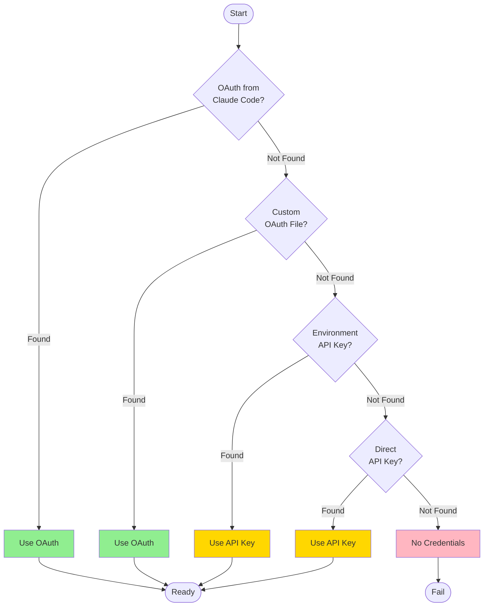

# User Guide

Comprehensive guide to using `claude-oauth-auth` for all your Claude API authentication needs.

## Table of Contents

- [Authentication Methods](#authentication-methods)
- [Configuration Options](#configuration-options)
- [Token Management](#token-management)
- [Best Practices](#best-practices)
- [Security Considerations](#security-considerations)
- [Advanced Usage](#advanced-usage)

## Authentication Methods

`claude-oauth-auth` supports multiple authentication methods with automatic fallback:

### 1. OAuth 2.0 (Recommended)

OAuth 2.0 is the most secure method and is automatically used when available.

#### Using Claude Code Tokens

If you have Claude Code installed, its OAuth tokens are automatically discovered:

```python
from claude_oauth_auth import OAuthTokenManager

# Automatically finds tokens from Claude Code
token_manager = OAuthTokenManager()
access_token = token_manager.get_valid_token()
```

**Token Locations Searched:**

- Linux/macOS: `~/.config/claude/auth.json`
- Windows: `%APPDATA%/claude/auth.json`
- Custom: Set `CLAUDE_AUTH_FILE` environment variable

#### Manual OAuth Configuration

For custom OAuth flows:

```python
from claude_oauth_auth import OAuthTokenManager

token_manager = OAuthTokenManager(
    refresh_token="your_refresh_token",
    access_token="your_access_token",
    token_expiry=1234567890,
    client_id="your_client_id"
)
```

### 2. API Key Authentication

Traditional API key authentication with automatic environment variable detection.

#### From Environment Variable

```bash
export ANTHROPIC_API_KEY="sk-ant-..."
```

```python
from claude_oauth_auth import UnifiedAuthManager, ClaudeClient

# Automatically uses ANTHROPIC_API_KEY
auth = UnifiedAuthManager()
client = ClaudeClient(auth)
```

#### Direct API Key

```python
from claude_oauth_auth import ClaudeClient

client = ClaudeClient(api_key="sk-ant-...")
```

### 3. Unified Authentication (Best Choice)

The `UnifiedAuthManager` tries multiple methods in order:

1. OAuth tokens from Claude Code
2. OAuth tokens from custom location
3. API key from environment variable
4. API key passed directly

```python
from claude_oauth_auth import UnifiedAuthManager

# Automatically discovers the best available method
auth = UnifiedAuthManager()

# Check which method was used
print(f"Using: {auth.auth_method}")  # "oauth" or "api_key"
```

**Priority Cascade:**



## Configuration Options

### Environment Variables

Configure behavior using environment variables:

```bash
# Claude authentication file location
export CLAUDE_AUTH_FILE="/path/to/auth.json"

# Anthropic API key
export ANTHROPIC_API_KEY="sk-ant-..."

# Enable debug logging
export CLAUDE_OAUTH_DEBUG=1

# Token refresh threshold (seconds before expiry)
export CLAUDE_TOKEN_REFRESH_THRESHOLD=300
```

### Configuration File

Create a configuration file for custom settings:

```json
{
  "oauth": {
    "client_id": "your_client_id",
    "token_endpoint": "https://api.anthropic.com/v1/oauth/token",
    "refresh_threshold_seconds": 300
  },
  "api_key": {
    "key": "sk-ant-...",
    "header_name": "x-api-key"
  },
  "storage": {
    "token_file": "~/.config/claude/auth.json",
    "secure": true
  }
}
```

Load configuration:

```python
from claude_oauth_auth import UnifiedAuthManager
import json

with open("config.json") as f:
    config = json.load(f)

auth = UnifiedAuthManager(config=config)
```

### Programmatic Configuration

Configure directly in code:

```python
from claude_oauth_auth import OAuthTokenManager, UnifiedAuthManager

# OAuth configuration
oauth_manager = OAuthTokenManager(
    refresh_token="...",
    client_id="...",
    token_expiry_threshold=600  # Refresh 10 minutes before expiry
)

# Unified configuration
auth = UnifiedAuthManager(
    oauth_manager=oauth_manager,
    api_key_fallback=True,
    prefer_oauth=True
)
```

## Token Management

### Automatic Token Refresh

OAuth tokens are automatically refreshed before expiry:

```python
from claude_oauth_auth import OAuthTokenManager

token_manager = OAuthTokenManager()

# Get a valid token (auto-refreshes if needed)
token = token_manager.get_valid_token()
```

**Refresh Behavior:**

- Tokens are refreshed 5 minutes before expiry by default
- Refresh is automatic and transparent
- Failed refresh falls back to API key if available

### Manual Token Refresh

Force a token refresh:

```python
from claude_oauth_auth import OAuthTokenManager

token_manager = OAuthTokenManager()

# Force refresh
new_token = token_manager.refresh_token()
print(f"New token: {new_token}")
```

### Token Validation

Check token status:

```python
from claude_oauth_auth import OAuthTokenManager

token_manager = OAuthTokenManager()

# Check if token is valid
if token_manager.is_token_valid():
    print("Token is valid")
else:
    print("Token expired or invalid")

# Get expiry time
expiry = token_manager.get_token_expiration()
print(f"Token expires at: {expiry}")

# Time until expiry
import datetime
time_left = expiry - datetime.datetime.now()
print(f"Time remaining: {time_left}")
```

### Token Storage

Control how tokens are stored:

```python
from claude_oauth_auth import OAuthTokenManager

# Default: Uses Claude Code location
token_manager = OAuthTokenManager()

# Custom location
token_manager = OAuthTokenManager(
    token_file="~/.my-app/tokens.json"
)

# In-memory only (no persistence)
token_manager = OAuthTokenManager(
    persist_tokens=False
)
```

## Best Practices

### 1. Use Unified Authentication

Always use `UnifiedAuthManager` for maximum compatibility:

```python
from claude_oauth_auth import UnifiedAuthManager, ClaudeClient

auth = UnifiedAuthManager()
client = ClaudeClient(auth)
```

### 2. Handle Authentication Errors

Always check for authentication failures:

```python
from claude_oauth_auth import UnifiedAuthManager, AuthenticationError

try:
    auth = UnifiedAuthManager()
    if not auth.has_credentials():
        raise AuthenticationError("No credentials found")
except AuthenticationError as e:
    print(f"Authentication failed: {e}")
    # Fall back to alternative method
```

### 3. Enable Logging in Development

Use logging to debug authentication issues:

```python
import logging

logging.basicConfig(
    level=logging.DEBUG,
    format='%(asctime)s - %(name)s - %(levelname)s - %(message)s'
)

from claude_oauth_auth import UnifiedAuthManager

auth = UnifiedAuthManager()
```

### 4. Separate Development and Production

Use different credentials for different environments:

```python
import os
from claude_oauth_auth import UnifiedAuthManager

if os.getenv("ENV") == "production":
    # Production: Use API key from secrets manager
    auth = UnifiedAuthManager(api_key=get_secret("CLAUDE_API_KEY"))
else:
    # Development: Use local OAuth tokens
    auth = UnifiedAuthManager()
```

### 5. Implement Retry Logic

Handle transient network errors:

```python
from claude_oauth_auth import ClaudeClient
import time

client = ClaudeClient()

for attempt in range(3):
    try:
        response = client.messages.create(...)
        break
    except Exception as e:
        if attempt < 2:
            time.sleep(2 ** attempt)  # Exponential backoff
        else:
            raise
```

## Security Considerations

### Never Commit Credentials

**DO NOT** commit authentication files to version control:

```gitignore
# .gitignore
auth.json
tokens.json
.env
config.json
**/credentials/**
```

### Use Environment Variables in Production

Store credentials in environment variables or secrets managers:

```python
import os
from claude_oauth_auth import UnifiedAuthManager

# Good: From environment
api_key = os.getenv("ANTHROPIC_API_KEY")
auth = UnifiedAuthManager(api_key=api_key)

# Bad: Hardcoded
auth = UnifiedAuthManager(api_key="sk-ant-...")  # DON'T DO THIS
```

### Secure Token Storage

Ensure token files have appropriate permissions:

```bash
# Linux/macOS
chmod 600 ~/.config/claude/auth.json
```

```python
import os
from claude_oauth_auth import OAuthTokenManager

# Check file permissions
token_file = os.path.expanduser("~/.config/claude/auth.json")
if os.path.exists(token_file):
    mode = os.stat(token_file).st_mode & 0o777
    if mode != 0o600:
        print("Warning: Token file has insecure permissions")
```

### Rotate API Keys Regularly

Implement key rotation:

```python
from datetime import datetime, timedelta

def should_rotate_key(last_rotation):
    return datetime.now() - last_rotation > timedelta(days=90)

# Rotate every 90 days
if should_rotate_key(last_rotation_date):
    new_key = generate_new_api_key()
    update_environment_variable("ANTHROPIC_API_KEY", new_key)
```

### Audit Authentication Events

Log authentication attempts:

```python
import logging

logger = logging.getLogger(__name__)

from claude_oauth_auth import UnifiedAuthManager

auth = UnifiedAuthManager()
logger.info(f"Authentication successful: method={auth.auth_method}")
```

## Advanced Usage

### Custom Authentication Provider

Implement your own authentication provider:

```python
from claude_oauth_auth import AuthProvider

class CustomAuthProvider(AuthProvider):
    def get_credentials(self):
        # Your custom logic
        return {
            "api_key": self.fetch_from_vault(),
            "metadata": {"source": "vault"}
        }

    def refresh_credentials(self):
        # Your refresh logic
        pass

# Use custom provider
auth = UnifiedAuthManager(custom_provider=CustomAuthProvider())
```

### Multiple Clients

Manage multiple Claude clients with different credentials:

```python
from claude_oauth_auth import ClaudeClient

# Client for user A
client_a = ClaudeClient(api_key="user_a_key")

# Client for user B
client_b = ClaudeClient(api_key="user_b_key")

# OAuth client
client_oauth = ClaudeClient()  # Uses OAuth from Claude Code
```

### Concurrent Requests

For concurrent requests, use threading:

```python
from concurrent.futures import ThreadPoolExecutor
from claude_oauth_auth import ClaudeClient

def make_request(question_num):
    client = ClaudeClient()
    return client.messages.create(
        model="claude-3-5-sonnet-20241022",
        max_tokens=100,
        messages=[{"role": "user", "content": f"Question {question_num}"}]
    )

# Process multiple requests concurrently
with ThreadPoolExecutor(max_workers=5) as executor:
    futures = [executor.submit(make_request, i) for i in range(10)]
    responses = [future.result() for future in futures]
```

### Caching Tokens

Implement token caching for performance:

```python
from functools import lru_cache
from claude_oauth_auth import OAuthTokenManager

class CachedTokenManager(OAuthTokenManager):
    @lru_cache(maxsize=1)
    def get_valid_token(self):
        return super().get_valid_token()

token_manager = CachedTokenManager()
```

### Testing with Mock Credentials

Use mock credentials for testing:

```python
from unittest.mock import patch
from claude_oauth_auth import UnifiedAuthManager

def test_authentication():
    with patch.dict('os.environ', {'ANTHROPIC_API_KEY': 'test-key'}):
        auth = UnifiedAuthManager()
        assert auth.has_credentials()
        assert auth.auth_method == "api_key"
```

## Authentication Methods Comparison

| Feature | OAuth 2.0 | API Key |
|---------|-----------|---------|
| **Setup Complexity** | Medium (requires Claude Code) | Easy (just set env var) |
| **Security** | High (automatic refresh) | Medium (manual rotation) |
| **Token Lifetime** | Auto-refreshed | Permanent until rotated |
| **Best For** | Long-lived apps, production | Scripts, testing, development |
| **Requires** | Claude Code or manual OAuth | API key from console |
| **Automatic Refresh** | Yes | N/A |
| **Fallback Support** | Falls back to API key | No fallback |

## Next Steps

| Document | What You'll Learn | Best For |
|----------|------------------|----------|
| **[Tutorial](tutorial.md)** | Step-by-step beginner guide | New users |
| **[Migration Guide](migration.md)** | Migrate from other solutions | Existing projects |
| **[Advanced Guide](advanced.md)** | Internals, optimization, patterns | Power users |
| **[Architecture](architecture.md)** | System design, diagrams | Understanding internals |
| **[API Reference](api.md)** | Detailed API documentation | Reference |
| **[Examples](examples.md)** | Real-world code examples | Integration patterns |
| **[FAQ](faq.md)** | Common questions | Quick answers |
| **[Troubleshooting](troubleshooting.md)** | Common issues and solutions | Problem solving |
