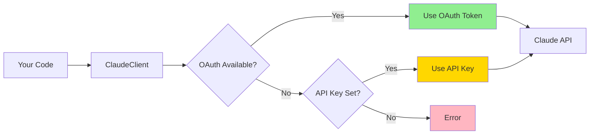

# Quick Start

Get started with `claude-oauth-auth` in just a few minutes!

## Installation

Install the package using pip:

```bash
pip install claude-oauth-auth
```

For development with all optional dependencies:

```bash
pip install claude-oauth-auth[dev]
```

For documentation tools:

```bash
pip install claude-oauth-auth[docs]
```

## Basic Usage (5 Lines of Code)

The simplest way to use `claude-oauth-auth` is with the unified authentication manager:

```python
from claude_oauth_auth import UnifiedAuthManager, ClaudeClient

# Automatically discovers credentials (OAuth or API key)
auth = UnifiedAuthManager()
client = ClaudeClient(auth)

# Use it like the standard Anthropic client
response = client.messages.create(
    model="claude-3-5-sonnet-20241022",
    max_tokens=1024,
    messages=[{"role": "user", "content": "Hello!"}]
)
print(response.content[0].text)
```

That's it! The library automatically:

1. Searches for OAuth tokens in standard locations
2. Falls back to API keys from environment variables
3. Handles token refresh automatically
4. Provides a ready-to-use Claude client

## OAuth Setup

### Option 1: Using Claude Code OAuth Tokens

If you're using Claude Code (the official Anthropic CLI), your OAuth tokens are already available:

```python
from claude_oauth_auth import OAuthTokenManager

# Automatically uses tokens from Claude Code
token_manager = OAuthTokenManager()
access_token = token_manager.get_valid_token()
```

The library searches these locations automatically:

- `~/.config/claude/auth.json` (Linux/macOS)
- `%APPDATA%/claude/auth.json` (Windows)
- Custom paths via environment variable `CLAUDE_AUTH_FILE`

### Option 2: Using Environment Variables (API Key)

Set your Anthropic API key as an environment variable:

```bash
export ANTHROPIC_API_KEY="your-api-key-here"
```

Then use the client normally:

```python
from claude_oauth_auth import UnifiedAuthManager, ClaudeClient

# Automatically uses ANTHROPIC_API_KEY from environment
auth = UnifiedAuthManager()
client = ClaudeClient(auth)
```

### Option 3: Direct API Key

Pass the API key directly to the client:

```python
from claude_oauth_auth import ClaudeClient

client = ClaudeClient(api_key="your-api-key-here")
```

## Verifying Your Setup

Run this simple test to verify everything is working:

```python
from claude_oauth_auth import UnifiedAuthManager

# Check what credentials were found
auth = UnifiedAuthManager()
print(f"Authentication method: {auth.auth_method}")
print(f"Credentials available: {auth.has_credentials()}")

# Test with a simple request
from claude_oauth_auth import ClaudeClient

client = ClaudeClient(auth)
response = client.messages.create(
    model="claude-3-5-sonnet-20241022",
    max_tokens=100,
    messages=[{"role": "user", "content": "Say hello!"}]
)
print(f"Response: {response.content[0].text}")
```

Expected output:

```
Authentication method: oauth
Credentials available: True
Response: Hello! How can I assist you today?
```

## Authentication Flow

Here's how authentication works automatically:



## Next Steps

Now that you have the basics working, explore more features:

| Next Step | What You'll Learn | Time |
|-----------|------------------|------|
| **[Tutorial](tutorial.md)** | Complete step-by-step guide for beginners | 30 min |
| **[User Guide](guide.md)** | All authentication methods and configuration | 15 min |
| **[Migration Guide](migration.md)** | Migrate from other auth solutions | 20 min |
| **[Advanced Guide](advanced.md)** | Performance, concurrency, custom sources | 30 min |
| **[Examples](examples.md)** | Real-world integration patterns | 15 min |
| **[API Reference](api.md)** | Detailed API documentation | 10 min |

### Recommended Learning Path

1. **Beginners**: Start with [Tutorial](tutorial.md) for guided walkthrough
2. **Migrating**: Check [Migration Guide](migration.md) for step-by-step migration
3. **Production**: Review [Advanced Guide](advanced.md) for optimization
4. **Troubleshooting**: See [FAQ](faq.md) and [Troubleshooting](troubleshooting.md)

## Common First Steps

### Enable Debug Logging

See what the library is doing under the hood:

```python
import logging

logging.basicConfig(level=logging.DEBUG)

from claude_oauth_auth import UnifiedAuthManager

auth = UnifiedAuthManager()
```

### Check Token Expiration

Verify when your OAuth token expires:

```python
from claude_oauth_auth import OAuthTokenManager

token_manager = OAuthTokenManager()
expires_at = token_manager.get_token_expiration()
print(f"Token expires at: {expires_at}")
```

### Handle Multiple Environments

Use different credentials for development and production:

```python
import os
from claude_oauth_auth import UnifiedAuthManager

# Development: Use OAuth from Claude Code
if os.getenv("ENV") == "development":
    auth = UnifiedAuthManager()
# Production: Use API key from secrets
else:
    auth = UnifiedAuthManager(api_key=os.getenv("PROD_API_KEY"))
```

## Getting Help

- Check the [Troubleshooting Guide](troubleshooting.md) for common issues
- Review the [Examples](examples.md) for more use cases
- Open an issue on [GitHub](https://github.com/astoreyai/claude-oauth-auth/issues)
